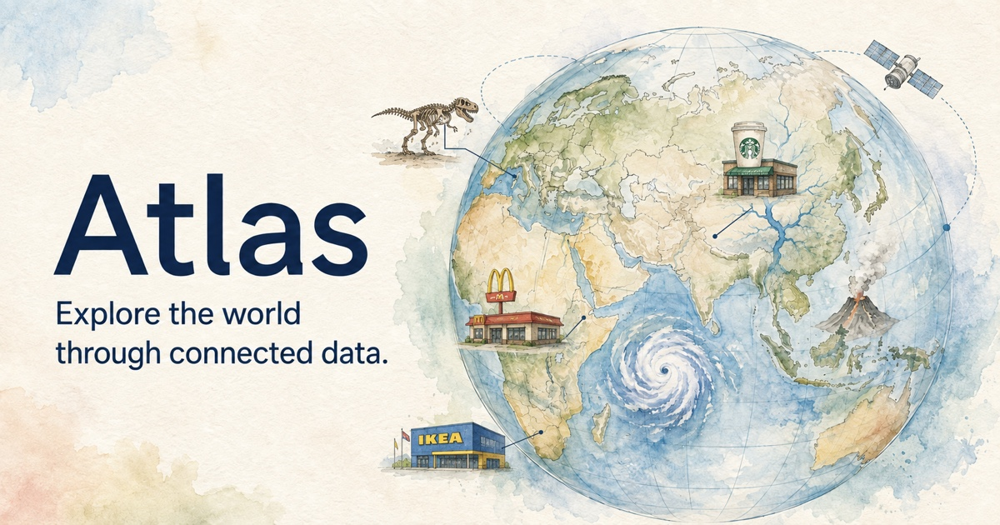
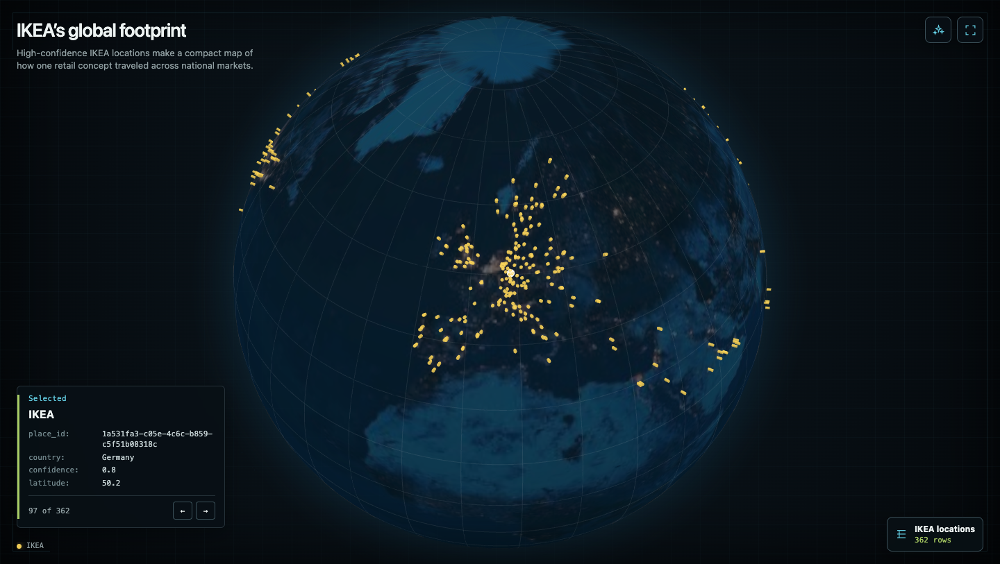

# Atlas Globe



Atlas is a static spatial data workbench designed for a person and an agent to use together. It runs DuckDB-Wasm and Globe.gl entirely in the browser, keeps every dataset in one local SQL catalog, and exposes the same query and visualization actions through WebMCP.



*Explore 362 IKEA locations worldwide, with each point opening a compact detail card.*

The implementation deliberately stays small: vanilla HTML, CSS, and JavaScript; no application framework; no server-side database; and no runtime CDN requests. The checked-in datasets are compact snapshots with open redistribution terms and source-level provenance.

## Run locally

Prerequisites: Node.js 20 or newer and npm.

```sh
npm ci
npm run serve
```

Open <http://127.0.0.1:4173/>. The local server adds the Permissions Policy and origin isolation headers required by WebMCP. The `preserve` lifecycle step copies pinned DuckDB-Wasm and Globe.gl files from `node_modules` into `vendor/` before serving.

The app remains usable when WebMCP is unavailable. For agent tool testing, use a browser with the current WebMCP implementation enabled and inspect its registered tools in DevTools.

## Build a static deployment

```sh
npm ci
npm run build
```

The generated `out/` directory is self-contained and can be uploaded to Cloudflare Pages or any equivalent static host. It includes:

- all runtime JavaScript and WebAssembly;
- ten compact datasets and ten precomputed opening scenes;
- local globe and catalog imagery;
- deployment headers, licenses, and provenance metadata; and
- `version.json` with a `b3-` BLAKE3 content fingerprint.

Add `?scene=theme_parks`, `?scene=earthquakes`, or another scene ID to make the randomized opening scene reproducible.

## What is included

The local DuckDB catalog contains ten relations:

- NOAA ocean drifter loops and Atlantic cyclone tracks;
- Natural Earth country boundaries and major rivers;
- USGS earthquakes;
- NOAA historical tsunami sources and runups;
- NOAA/SPC United States tornado tracks;
- Overture Maps locations for eight global chains; and
- Wikidata theme parks and heritage landmarks.

`data/sources.json` records the publisher, source and download URL, retrieval date, transformation, caveats, row count, and SHA-256 digest for every relation. See [DATA_LICENSES.md](DATA_LICENSES.md) for the redistribution terms and required attribution.

The repository intentionally omits raw acquisition caches, duplicated CSV exports, generated build output, and datasets without sufficiently clear open redistribution terms.

## WebMCP surface

Atlas registers six imperative tools with `document.modelContext.registerTool()`:

1. `inspect_workspace`
2. `inspect_relation`
3. `load_dataset`
4. `execute_sql`
5. `render_globe_scene`
6. `present_result`

The intended loop is:

```text
inspect workspace → inspect relation → execute SQL → render globe scene → present result
```

Tools call the same domain functions as the human UI. SQL is restricted to one read-only `SELECT` or `WITH` statement, file and network readers are blocked, and saved results are capped at 25,000 rows. Scene specifications are declarative: a scene references saved result IDs and maps columns to points, paths, rings, or GeoJSON polygons without executing agent-authored JavaScript.

`load_dataset` can add a public CORS-enabled CSV/Parquet URL or at most 500 inline records. Imported data is labeled separately from the bundled catalog and retains the supplied provenance.

## Project layout

```text
app.js, webmcp.js       app state, DuckDB, globe scenes, and WebMCP tools
index.html, styles.css  compact responsive interface
data/                   open, browser-ready dataset snapshots and metadata
assets/                 project artwork and the local globe texture
scripts/                reproducible runtime, scene, static-build, and checks
third_party/licenses/   license texts for bundled runtime dependencies
```

## Checks

```sh
npm run check
npm run build
npm run check:data
```

The data check opens every relation in DuckDB, validates expected coverage, verifies every catalog image, and checks the generated scene contract.

## License

Application source and project artwork are available under the [MIT License](LICENSE). Third-party code and datasets retain their own terms; see [THIRD_PARTY_NOTICES.md](THIRD_PARTY_NOTICES.md), [DATA_LICENSES.md](DATA_LICENSES.md), and `data/sources.json`.

The bundled datasets are illustrative snapshots, not operational decision-support products. Brand names identify records in the source data and do not imply endorsement.
